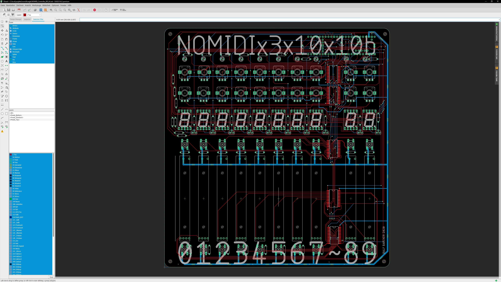
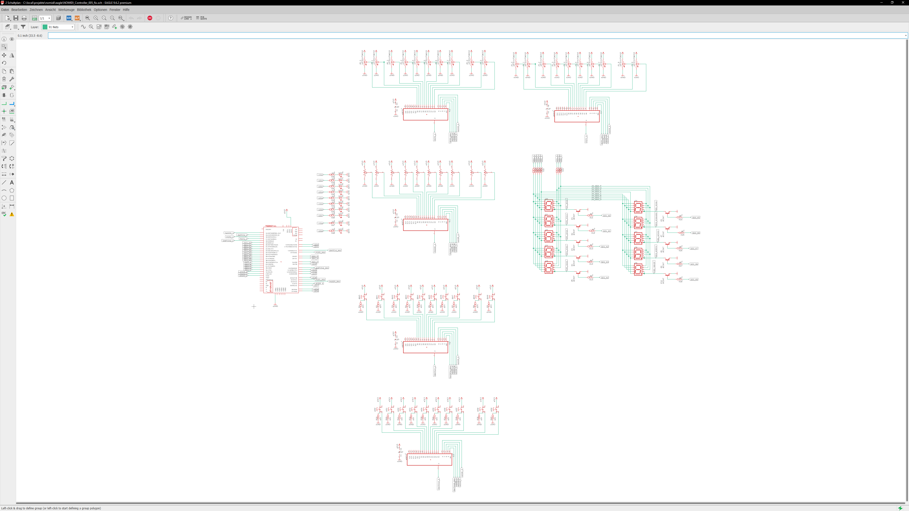
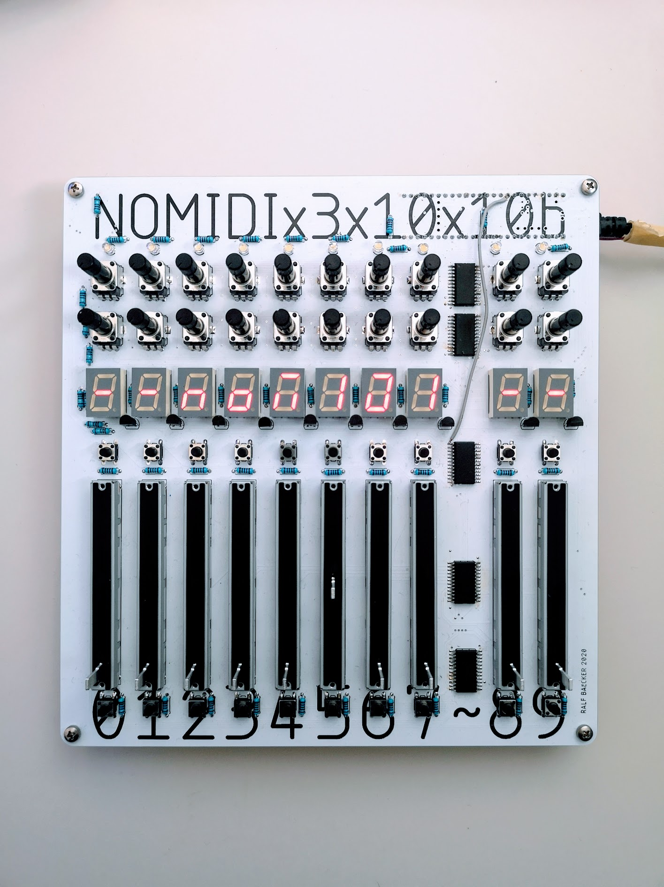

# Designing PCBs with Eagle

One day introduction into the PCB [(Printed Circuit Board)](https://en.wikipedia.org/wiki/Printed_circuit_board) CAD software **Eagle**  ([www.autodesk.com/products/eagle/overview](hthttps://www.autodesk.com/products/eagle/overview)). The workshop offers a fundamental introduction into concepts, user interface and workflow. A full workflow cycle - form schematic to board layout and the final production in a factory in china - will be explained.

- **Date:** Monday **2020-12-21** / **10:00** - **18:00**
- **Registration:** Send me an email or direct message for a **binding** registration. Please make sure that you are able to join the workshop for the **full day**. (The workshop is limited to **15 participants**)
- The workshop will be held **online via MS Teams.**

## Pre/Requirements:

1. Participants should have **good/solid** knowledge in electronics and fundamental electric laws incl. reading schematics, soldering and some experiance with sourcing parts. (At leased you should have already made **some** circuits on breadboards or with perfboard ).
2. It could be helpful to have already a **little** project in mind.
3. Please install the free/educational version of  **EAGLE** form from the [autodesk website](https://www.autodesk.de/products/eagle/free-download?plc=F360&term=1-YEAR&support=ADVANCED&quantity=1). (It's now strangly bundeled with Fursion 360. Look for educational licence )
5. A **three button** mouse incl. **wheel** is **very** helpful!
4. Coffee and food by hand.

## Schedule x Content *(preliminary)*:

* **10:00 - 12:00** | *Fundamentals*

  1. Introduction
     - Why design your own PCBs?
     - Environmental Footprint?
     - *Design*ing PCB as a *designer*?
     - DIP vs SMD?
     - Materials
     - Fabrication in China or at home?
 
  2. Schematics
     - Eagle User Interface and basic concepts.
     - Adding Parts - know your parts!
     - Libraries of Parts
     - Connecting Parts
     
  3. Q&A Time I
     - The participants can repeat and experiment the learned and ask questions  
     - Share your screen!

* **12:00 - 13:00** | *Lunch Break*

* **13:00 - 15:00** |  *Layouting a Board*

  4. Placing parts
  5. Ground plate
  6. Routing signals
  7. Vias
  8. Q&A Time II

* **15:00 - 16:00** | *Kaffee x Kuchen Break / BYOC (Bring your own Cake)*

* **16:00 - 18:00** | *Preparing for Production*

  9. Testing and Checking ERC + DRC
  10. Exporting Gerber Files
  11. Uploading files to your chinese manufacturer of choice!

* **18:00** | *EOW*

